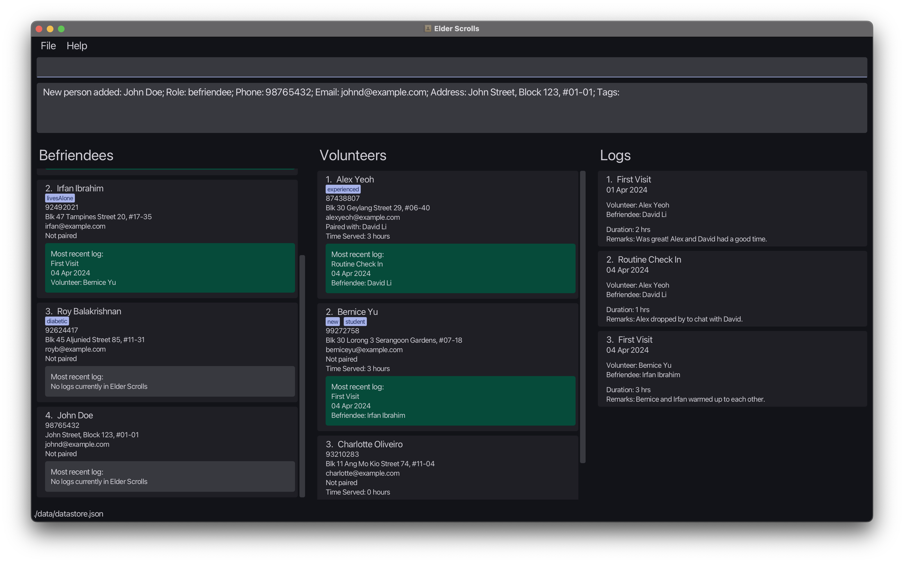
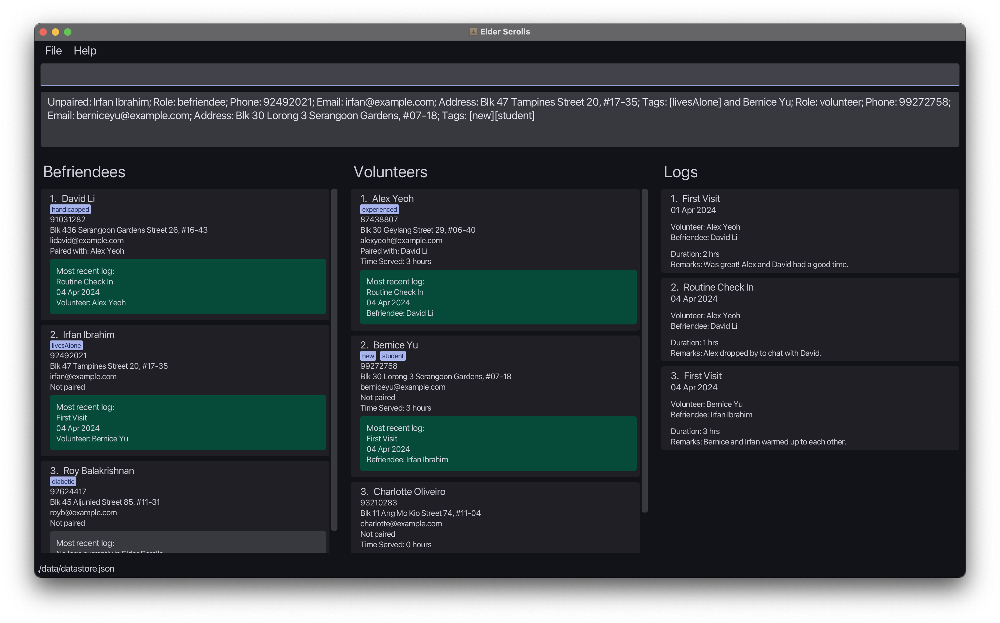
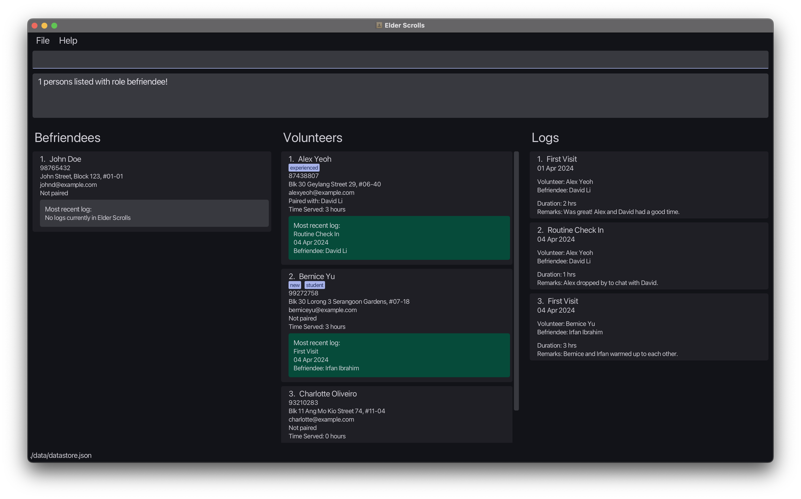
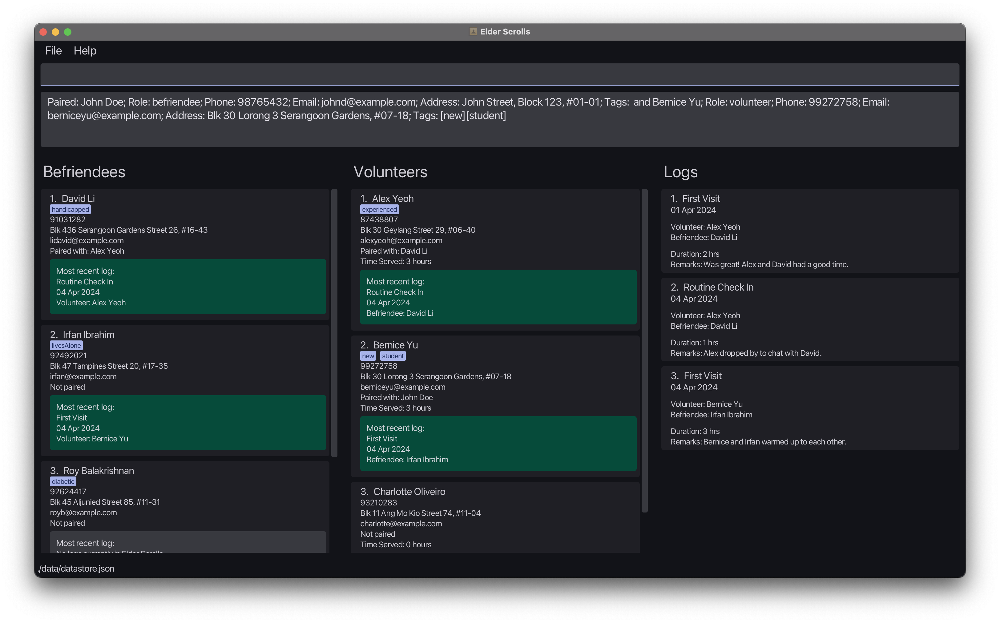
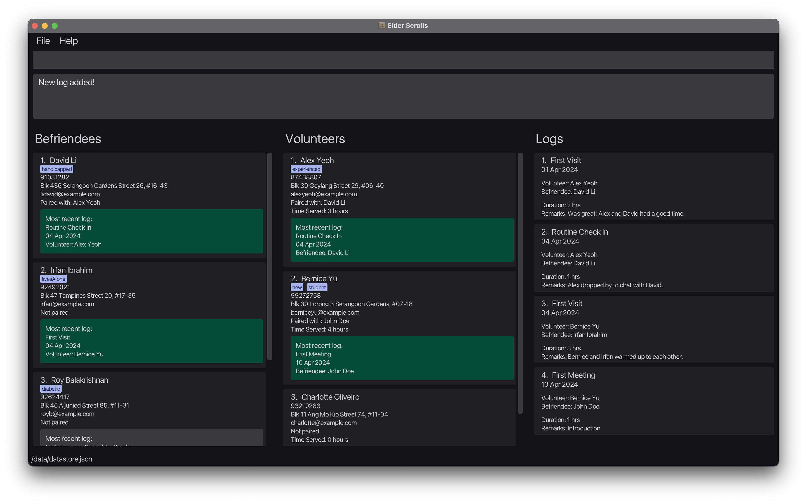
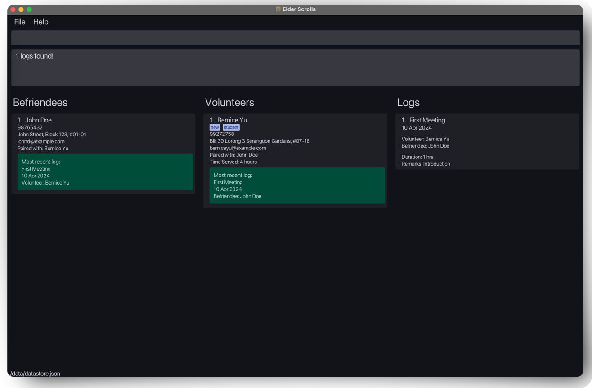
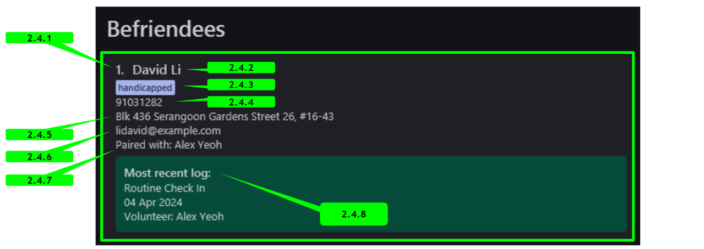
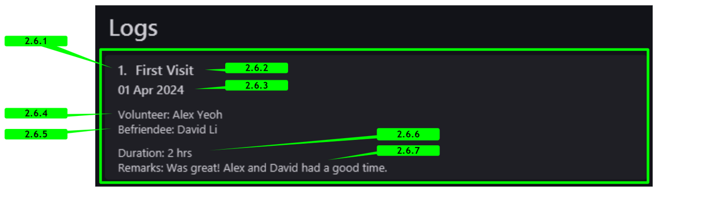

## **Introduction - What is Elder Scrolls?**

{: style="text-align: justify" }
**Elder Scrolls is a** ___free Volunteer Management System (VMS)___ that streamlines the coordination of volunteers and befriendees, with a particular focus on elderly befriending programs. Elder Scrolls combines the _speed of Command Line Interface (CLI) interaction_ with the _benefits of a Graphical User Interface (GUI)_. Whether you prefer the agility of typing or the convenience of visual interaction, Elder Scrolls ensures that your volunteer management tasks are completed swiftly and seamlessly.

{: style="text-align: justify" }
**Elder Scrolls is crafted with _volunteer managers_, and _organizers_ involved in elderly befriending initiatives in mind**. Whether you're managing volunteers for elderly care, community outreach, or other social services, Elder Scrolls offers a comprehensive solution for you to simplify and enhance your volunteer management efforts.

{: style="text-align: justify" }
**No more cumbersome bookkeeping**: manage volunteers and befriendees seamlessly in one intuitive platform. Say goodbye to endless spreadsheets – Elder Scrolls centralizes tasks, making them faster and more effective, with **two main features**: ___Volunteer/Befriendee Management___, and ___Log Management___. These features allow you to effortlessly add and update your volunteers' and befriendees' information, and easily keep track of all the interactions between them. 

{: style="text-align: justify" }
Developed for efficiency by our team, ___Elder Scrolls lets you focus on what matters most – making a difference in the lives of others___.

<div style="page-break-after: always;"> </div> 

## **About this User Guide**

{: style="text-align: justify" }
**Welcome to the user guide for Elder Scrolls!** Thank you for choosing our application! Whether you're new or experienced, this guide has everything you need to quickly get acquainted. Find answers, get step-by-step instructions, and learn about all the features Elder Scrolls has to offer:

* [**Quick Start**](#1-quick-start): Get started with Elder Scrolls quickly and easily.
* [**User Interface**](#2-user-interface): Understand the intuitively simple layout of Elder Scrolls.
* [**Features**](#3-features): Explore all the functionalities of Elder Scrolls.
* [**Command Summary**](#8-command-summary): Find all the essential commands at a glance.
* [**FAQs**](#6-faq-frequently-asked-questions): Get answers to common questions about Elder Scrolls.
* [**Glossary**](#9-glossary): Familiarise with key terms and concepts used in Elder Scrolls.
* Spot the **:bulb: symbol** for tips provided to enhance your experience!

Let's dive in and maximize your Elder Scrolls experience!

--------------------------------------------------------------------------------------------------------------------

## **Table of Contents**

* Table of Contents
{:toc}

--------------------------------------------------------------------------------------------------------------------

## **Setting Up**

Before getting started, let's ensure everything is set up for Elder Scrolls to run correctly:

1. Ensure you have `Java 11` installed on your computer. This is crucial for Elder Scrolls to function properly.
    * If you're unsure whether Java 11 is installed, follow this short [guide](https://www.baeldung.com/java-check-is-installed) to check.
    * Install Java 11 (if needed): If Java 11 is not installed, follow the provided installation instructions [here](https://docs.oracle.com/en/java/javase/11/install/overview-jdk-installation.html#GUID-8677A77F-231A-40F7-98B9-1FD0B48C346A). If you're using a Mac computer with Apple Silicon, you can download Java 11 from [here](https://www.azul.com/downloads/?version=java-11-lts&os=macos&architecture=arm-64-bit&package=jdk-fx#zulu) instead.
2. Next, download our latest `elderscrolls.jar` release [here](https://github.com/AY2324S2-CS2103T-T09-3/tp/releases).
3. Next, copy the downloaded `elderscrolls.jar` to the desired home folder for Elder Scrolls. Elder Scrolls will store all application files and data in this folder, so it is best to create an empty folder for this purpose.

--------------------------------------------------------------------------------------------------------------------

## **1. Quick Start**
[Back to About & Table of Contents  ←](#about-this-user-guide)

Once you've completed the setup, you're ready to launch Elder Scrolls! Let's get started:

1. Open a command terminal, and navigate by using `cd` into the folder you put the jar file in.
2. Use the `java -jar elderscrolls.jar` command to run the application.<br>

A GUI similar to the one below should appear in a few seconds. If this is your first time launching Elder Scrolls, the application should contain some sample data to get you started!

<div style="text-align:center; margin-bottom: 1.5em">
   <br>
  <i>The starting user interface with sample data</i>
</div>

After this, you're all set to begin using Elder Scrolls! Let's make managing volunteers and befriendees a breeze.

**Let's walk through some important commands to get you started:**

1. The most integral function of Elder Scrolls is to help you to keep track of the people in your volunteering organisation. Naturally, there is a way to add new volunteers and befriendees to the system. Let's try adding a new befriendee, John Doe, to the system using the **`add` command**.

    ```
    add n/John Doe p/98765432 e/johnd@example.com a/Blk 123 #01-01 r/befriendee
    ```
   
   <div style="text-align:center; margin-bottom: 1.5em">
     <br>
    <i>Scroll down the left <code>Befriendees</code> list to see John's card at the bottom of the list.</i>
   </div>

    

2. John now needs a volunteer friend! Let's have volunteer Bernice take care of him. From the list, you can see that Bernice has been hard at work befriending Irfan, but sadly, we'll need to reassign her. Let's unpair Bernice and Irfan using the **`unpair` command**, since Irfan sits at the 2nd index in the befriendee list.

    ```
    unpair 2 2
    ```

   <div style="text-align:center; margin-bottom: 1.5em">
     <br>
    <i>Both lists should reset to their original state, and looking at Bernice and Irfan's cards, they are no longer paired.</i>
   </div>
     

3. Now we are ready to pair Bernice with John. But John's card is far down the list, and it can be inconvenient to scroll down to find his index. No problem, one of the most powerful features of Elder Scrolls is the **`find` command**. 

    This command allows you to search for contacts based on various criteria, such as name, role, pairing status, and tags. Now, let's try to bring John to the top of our list using the **`find` command**.

    ```
    find r/befriendee John
    ```
   <div style="text-align:center; margin-bottom: 1.5em">
         <br>
        <i>Here, we've specified the <code>r/befriendee</code> filter, which ensures we only search in the <code>Befriendees</code> list, leaving the <code>Volunteers</code> list untouched.</i> 
   </div>

4. Now that we've found John, let's pair him with Bernice. Bernice sits at the 2nd index in the volunteer list, so we can pair them using the **`pair` command**.

    ```
    pair 1 2
    ```
   <div style="text-align:center; margin-bottom: 1.5em">
         <br>
        <i>You should see the <code>Paired with:</code> field in Bernice and John's cards reflect the new pairing.</i> 
   </div>


5. Finally, let's add an entry in `Logs` to record the first meeting between Bernice and John. We can `find` John again, then use the **`logadd` command** to do this.

    ```
    find r/befriendee John
    ```
    ```
    logadd 1 2 t/First Meeting s/2024-04-10 d/1 r/Introduction
    ```
   
    <div style="text-align:center; margin-bottom: 1.5em">
         <br>
        <i>You should see the log card appear in the <code>Logs</code> list on the right, with the details supplied.</i>
    </div>

6. To double-check that our log has been added, let's use the **`logfind` command**, which can help us to find all logs associated with John. First, let's search for our pair John and Bernice, then use the `logfind` command to find the log we just added.

    ```
    find john bernice
    ```
    ```
    logfind 1 r/befriendee
    ```

    <div style="text-align:center; margin-bottom: 1.5em">
         <br>
        <i>You should see a single log card in the <code>Logs</code> list, which we have just added.</i>
    </div>


7. This summarizes the basic workflow of Elder Scrolls. To reset your view of each list and clear all filters, use the **`list` command**. Feel free to remove the sample data and start fresh by using the **`clear` command** and get **started with your own data!**

    ```
    list
    ```
    ```
    clear
    ```

    **The lists should now be empty, ready for you to start managing your own volunteers and befriendees!**

7. You can refer to the [**Features**](#3-features) below for detailed descriptions of all the commands available in Elder Scrolls.

--------------------------------------------------------------------------------------------------------------------

[//]: # (Page Break:)
<div style="page-break-after: always;"> </div> 


## **2. User Interface**
[Back to About & Table of Contents  ←](#about-this-user-guide)

<div style="text-align:center;">
  
  <p></p>
  <i>User interface Layout Breakdown of Elder Scrolls </i>
</div>

### 2.1 Toolbar

The toolbar at the top provides functionality for **accessing help and exiting** Elder Scrolls. The application window contains the following buttons:
* `File`: Hovering over opens a dropdown menu, click on Exit to close the application!
* `Help`: Hovering over opens a dropdown menu, whereby clicking on Help F1 opens a help pop-up!

### 2.2 Command Input Box

The command input box at the top of the application window is where you can **type commands to interact** with Elder Scrolls. **Press `Enter` to execute** the command.

### 2.3 Command Output Box

The command output box displays the **results of the commands** you have executed. It also **displays error messages** when an invalid command is entered. Paying close attention to the feedback provided here helps enhance your experience with Elder Scrolls!

### 2.4 Befriendee List Panel

This section **displays all your registered befriendees**, and you may filter the display using our supported find commands. The list is updated in real time as you execute commands.

<p style="font-weight:500; font-size:20px">Befriendee List Card</p>

Each befriendee list card displays the following information:

<div style="text-align:center; margin-bottom: 1.5em">
   <br>
</div>

1. **Index**: The index of the befriendee in the list.
2. **Name**: The name of the befriendee.
3. **Tags**: Tags associated with the befriendee.
4. **Phone Number**: The phone number of the befriendee.
5. **Address**: The address of the befriendee.
6. **Email**: The email address of the befriendee.
7. **Paired with**: The name of the volunteer the befriendee is paired with, if any.
8. **Most Recent Log**: The most recent log associated with the befriendee, if any.

<div style="page-break-after: always;"> </div> 

### 2.5 Volunteer List Panel

Similar to the Befriendee List Panel, this section **displays all your registered volunteers**. The volunteer list cards also support an added aggregate statistic `Time Served`, which helps you better track volunteer hours!

<p style="font-weight:500; font-size:20px">Volunteer List Card</p>

<div style="text-align:center; margin-bottom: 1.5em">
   <br>
</div>

1. **Index**: The index of the volunteer in the list.
2. **Name**: The name of the volunteer.
3. **Tags**: Tags associated with the volunteer.
4. **Phone Number**: The phone number of the volunteer.
5. **Address**: The address of the volunteer.
6. **Email**: The email address of the volunteer.
7. **Paired with**: The name of the befriendee the volunteer is paired with, if any.
8. **Time Served**: The total time volunteered by the volunteer, in hours.
9. **Most Recent Log**: The most recent log associated with the volunteer, if any.

<div style="page-break-after: always;"> </div> 

### 2.6 Log List Panel

Your Log List Panel **displays all logs associated with your befriendees and volunteers**.

<p style="font-weight:500; font-size:20px">Log List Card</p>

<div style="text-align:center; margin-bottom: 1.5em">
   <br>
</div>

1. **Index**: The index of the log in the list.
2. **Title**: The title of the log.
3. **Start Date**: The date recorded in the log of the activity.
4. **Volunteer Name**: The name of the volunteer associated with the log.
5. **Befriendee Name**: The name of the befriendee associated with the log.
6. **Duration**: The duration of the activity in hours.
7. **Remarks**: Any additional remarks or notes about the activity.

--------------------------------------------------------------------------------------------------------------------
<div style="page-break-after: always;"> </div> 


## **3. Features**
[Back to About & Table of Contents  ←](#about-this-user-guide)

<div markdown="block" class="alert alert-info">

**:information_source: Notes about the command format:**<br>

* For all commands which require an `INDEX` (e.g., `VOLUNTEER_INDEX`), the index refers to the index number shown in the displayed person list.
  The indexes provided **must be indexes of people currently displayed in the person lists**.
  * As the indexes are one-based, index values must be positive integers greater than 0. Any other values are automatically invalidated and hence constitute an invalid command format. 

* Words in `UPPER_CASE` are placeholders to represent parameters that should be supplied by the user.<br>
  e.g. in `add n/NAME`, `NAME` is a parameter which can be used as `add n/John Doe`.

* Items in square brackets are optional.<br>
  e.g `n/NAME [t/TAG]` can be used as `n/John Doe t/friend` or as `n/John Doe`.

* Items with `…`​ after them can be used multiple times including zero times.<br>
  e.g. `[t/TAG]…​` can be used as ` ` (i.e. 0 times), `t/friend`, `t/friend t/family` etc.

* Parameters can be in any order.<br>
  e.g. if the command specifies `n/NAME p/PHONE_NUMBER`, `p/PHONE_NUMBER n/NAME` is also acceptable.

* Extraneous parameters for commands that do not take in parameters (such as `help`, `list`, `exit` and `clear`) will be ignored.<br>
  e.g. if the command specifies `help 123`, it will be interpreted as `help`.

* If you are using a PDF version of this document, be careful when copying and pasting commands that span multiple lines as space characters surrounding line breaks may be omitted when copied over to the application.
</div>

<div style="page-break-after: always;"> </div> 

### **3.1 Volunteer / Befriendee Management**

#### 3.1.1 Adding a Volunteer or Befriendee: `add`

Adds a volunteer/befriendee to the address book.

Format: `add n/NAME r/ROLE p/PHONE_NUMBER e/EMAIL a/ADDRESS [t/TAG]…​`

Constraints:
* `n/NAME` must be alphanumeric and cannot be empty.
* `p/PHONE_NUMBER` must be at least 3 digits long.
* `r/ROLE` must **only** be either `volunteer` or `befriendee`, which will add either a volunteer or befriendee respectively.
* `e/EMAIL` must be a valid email address of the format `local-part@domain`.
* `a/ADDRESS` has no limitations but cannot have line breaks, i.e., it should be the single-line format for addresses.
* `t/TAG` must be alphanumeric.
* `n/NAME`, `r/ROLE`, `p/PHONE_NUMBER`, `e/EMAIL` and `a/ADDRESS` must be provided and cannot be empty.

<div markdown="span" class="alert alert-primary">:bulb: **Tip:**
A person can have any number of tags (including 0).
</div>

Examples:
* `add n/John Doe r/volunteer p/98765432 e/johnd@example.com a/John street, block 123, #01-01`
* `add n/Betsy Crowe r/befriendee t/friend e/betsycrowe@example.com a/Newgate Prison p/1234567 t/criminal t/homicide`

#### 3.1.2 Editing a person : `edit`

Edits an existing person in Elder Scrolls.

Format: `edit INDEX r/ROLE [n/NAME] [p/PHONE] [e/EMAIL] [a/ADDRESS] [t/TAG]…​`

Constraints:
* `n/NAME` must be alphanumeric and cannot be empty.
* `p/PHONE_NUMBER` must be at least 3 digits long.
* `r/ROLE` must **only** be either `volunteer` or `befriendee`, which will edit either a volunteer or befriendee respectively.
* `e/EMAIL` must be a valid email address.
* `a/ADDRESS` has no limitations but cannot have line breaks, i.e., it should be the single-line format for addresses.
* `t/TAG` must be alphanumeric.

Additional Information:
* Edits the person at the specified `INDEX` for the list corresponding to the provided role. For example, if `r/volunteer` is provided, the person at the `INDEX` in the volunteer list will be edited.
* At least one of the optional fields must be provided.
* Existing values will be updated to the input values.
* When editing tags, the existing tags of the person will be removed i.e. adding of tags is not cumulative.
* You can remove all the person’s tags by typing `t/` without specifying any tags after it.

Examples:
*  `edit 1 r/volunteer p/91234567 e/johndoe@example.com` Edits the phone number and email address of the 1st person to be `91234567` and `johndoe@example.com` respectively.
*  `edit 2 r/befriendee n/Betsy Crower t/` Edits the name of the 2nd person to be `Betsy Crower` and clears all existing tags.

#### 3.1.3 Pairing a befriendee and volunteer : `pair`

Pairs an existing befriendee and volunteer in Elder Scrolls.

Format: `pair BEFRIENDEE_INDEX VOLUNTEER_INDEX`

* The person at `BEFRIENDEE_INDEX` must be a befriendee and the person at `VOLUNTEER_INDEX` must be a volunteer.
* Neither of the two people should be paired, if they are, they must be unpaired before pairing again.

Examples:
*  `pair 1 2` Pairs the befriendee at Index 1 of the befriendee list and the volunteer at Index 2 of the volunteer list.
*  `pair 3 3` Pairs the befriendee at Index 3 of the befriendee list and the volunteer at Index 3 of the volunteer list.

[//]: # (Page Break:)
<div style="page-break-after: always;"> </div> 

#### 3.1.4 Unpairing a befriendee and volunteer : `unpair`

Unpairs an existing befriendee and volunteer in Elder Scrolls.

Format: `unpair BEFRIENDEE_INDEX VOLUNTEER_INDEX`

* The person at `BEFRIENDEE_INDEX` must be a befriendee and the person at `VOLUNTEER_INDEX` must be a volunteer.
* The befriendee and volunteer must be paired with each other before they can be unpaired.

<div markdown="block" class="alert alert-primary">

:bulb: **Tip:** <br>

Unpairing can be greatly simplified with the help of the `find` command.
For example, let's say you would like to unpair `David Li`.
1. Find the name of David's partner by using `find David`, and looking at the `Paired with:` field.
2. Let's say his partner's name is `Alex`, now use `find --paired David Alex` to list only David and his partner.
3. Use `unpair 1 1` to unpair David and his partner, as they will likely be the only people listed.

The same strategy can be applied any time you wish to find who a person is paired with specifically.

</div>

Examples:
*  `unpair 1 2` Unpairs the befriendee at Index 1 of the befriendee list and the volunteer at Index 2 of the volunteer list.
*  `unpair 3 3` Unpairs the befriendee at Index 3 of the befriendee list and the volunteer at Index 3 of the volunteer list.

#### 3.1.5 Listing all persons : `list`

Shows a list of all persons and logs in Elder Scrolls.

Format: `list`

* Persons and Logs are listed separately, and in the order they were added, from earliest to latest.
* The list command is commonly used with the `find` command to reset the view after a search.

[//]: # (Page Break:)
<div style="page-break-after: always;"> </div> 

#### 3.1.6 Locating persons: `find`

Find persons through a variety of filters.

Format: `find [FILTERS]`
Alternative format: `search [FILTERS]`

**At least 1** filter must be provided. 
The following filters are supported:

* By name: `NAME`
* By pairing status: `--paired` or `--unpaired`
* By tag: `t/TAG`
* By role: `r/ROLE`

##### By name: `NAME`

In its most basic form, the command requires a single _case-insensitive_ `NAME` filter, which will filter both lists for all persons whose **names** contain the given `NAME`. Only full words will be matched.

Example: `find david` (finds all persons with `David`, `david`, etc. in their names, but will not find `Davidson` or `Davidsonson`)

`NAME` is also the **only** filter which can be provided multiple times. Providing multiple `NAME` filters will return all persons whose names contain any of the given `NAME`s.

Example: `find David Yeoh` (finds all persons with `David` _or_ `Yeoh` in their names, like `David Li`, `Alex Yeoh`, and even `Yeoh David`)

##### By pairing status: `--paired` or `--unpaired`

If the `--paired` or `--unpaired` filter is provided, the search will be limited to either paired or non-paired persons.

Examples: 
* `find --unpaired` (finds all unpaired persons)
* `find --paired David` (finds all paired persons with `David` in their names)

##### By tag: `t/TAG`

If the _case-sensitive_ `t/TAG` filter is provided, the search will be limited to persons with the specified tag(s).

Example: `find t/friend` (finds all persons who have the tag `friend`)

[//]: # (Page Break:)
<div style="page-break-after: always;"> </div> 

##### By role: `r/ROLE`

The `r/ROLE` filter is provided, the search will be limited to the specified list. The other list remains unaffected.
Only two versions of this filter are allowed: `r/volunteer` and `r/befriendee`.

<div markdown="span" class="alert alert-primary">:bulb: **Tip:**
The `r/ROLE` filter can only be applied together with another filter. It cannot be used on its own.
</div>

Example: `find r/volunteer David` (finds all volunteers with `David` in their names, the befriendee list remains unfiltered)

##### Combining filters

* Different types of filters can be combined to narrow down the search results further.
* When multiple filters are provided, each filter should be separated by a space. 
* The order in which filters are provided does not matter.
* Invalid filters (e.g. `r/XXX, -paired`) will be ignored, and the search will proceed with the valid filters to enhance efficiency.

Examples:
* `find alex david`
  

[//]: # (Page Break:)
<div style="page-break-after: always;"> </div> 

* `find r/volunteer t/student --paired Bernice` (finds all paired volunteers with the tag `student` and name containing `Bernice`)
  

<div markdown="span" class="alert alert-primary">:bulb: **Tip:**
Use the `list` command to reset your view after using the `find` command.
</div>

#### 3.1.7 Deleting a person : `delete`

Deletes the specified person from Elder Scrolls.

Supported aliases for `delete`: `del`, `remove`, `rm`

Format: `delete INDEX r/ROLE`

* Deletes the person at the specified `INDEX`, for the list corresponding to the provided role.
* The deleted person must not be paired with any other person.
* Deletion is not allowed if there exists associated logs to the person. 
* As such, a paired person must be unpaired, with all associated logs deleted before the person may be removed from Elder Scrolls, to ensure consistency of data.

Examples:
* `list` followed by `delete 2 r/volunteer` Deletes the 2nd volunteer in the application.
* `find Betsy` followed by `del 1 r/befriendee` Deletes the 1st befriendee found with `Betsy` in their name.

--------------------------------------------------------------------------------------------------------------------
[//]: # (Page Break:)
<div style="page-break-after: always;"> </div> 

### **3.2 Log Management**

#### 3.2.1 Adding a log : `logadd`

Adds a log for an existing paired befriendee and volunteer. If the added log is their most recent log, the respective persons' `latest log` card details updates accordingly.

Format: `logadd BEFRIENDEE_INDEX VOLUNTEER_INDEX t/TITLE s/START_DATE d/DURATION r/REMARKS`

Constraints:
* The person at `BEFRIENDEE_INDEX` must be a befriendee and the person at `VOLUNTEER_INDEX` must be a volunteer.
* The two persons must be paired before a log can be added.
* The `START_DATE` must be in the format `YYYY-MM-DD`. Valid dates range from `0001-01-01` to `9999-12-31`. Only dates that exist in the standard Gregorian calendar are accepted.
* The `DURATION` **must be a positive integer** ranging from 1 to 999. We cannot guarantee correct behaviour for durations exceeding 999 hours.
* `t/TITLE`, `s/START_DATE`, `d/DURATION` and `r/REMARKS` must be provided.
* `s/START_DATE`, `d/DURATION` cannot be empty.

Examples:
* `logadd 1 1 t/Movies s/2020-01-09 d/3 r/had popcorn` Adds a log between the befriendee at Index 1 and the volunteer at Index 1 with the title `Movies`, start date `2020-01-09`, duration `3` and remarks `had popcorn`.
* `logadd 2 3 t/Shopping s/2020-09-09 d/2 r/bought groceries` Adds a log between the befriendee at Index 2 and the volunteer at Index 3 with the title `Shopping`, start date `2020-09-09`, duration `2` and remarks `bought groceries`.

#### 3.2.2 Editing a log : `logedit`

Edits an existing log in Elder Scrolls.

Format: `logedit INDEX [t/TITLE] [s/START_DATE] [d/DURATION] [r/REMARKS]`

Constraints:
* Edits the log at the specified `INDEX`.
* At least one of the optional fields must be provided.
* Existing values will be updated to the input values.
* The `START_DATE` must be in the format `YYYY-MM-DD`. Valid dates range from `0001-01-01` to `9999-12-31`. Only dates that exist in the standard Gregorian calendar are accepted.
* The `DURATION` **must be a positive integer** ranging from 1 to 999. We cannot guarantee correct behaviour for durations exceeding 999 hours.

Examples:
* `logedit 1 t/Cinema Visit s/2020-01-10 d/3 r/had popcorn` Edits the title, start date, duration and remarks of the 1st log to be `Movies`, `2020-01-09`, `3` and `had popcorn` respectively.

#### 3.2.3 Deleting a log : `logdelete`

Deletes the specified log from the address book.

Supported aliases for `logdelete`: `logdel`, `logremove`, `logrm`

Format: `logdelete INDEX`

* Deletes the log at the specified `INDEX`.

Examples:
* `list` followed by `logdelete 1` deletes the 1st log in the address book.
* `logfind 1 r/befriendee` followed by `logdelete 1` deletes the 1st log in the results of the `logfind` command.

#### 3.2.4 Finding a log associated with a person: `logfind`

Find all logs associated with a person.

Format: `logfind INDEX r/ROLE`

* Find all logs associated with the person at the specified `INDEX`, for the list corresponding to the provided role.

Examples:
* `logfind 1 r/befriendee` returns all logs associated with the befriendee at Index 1.
* `logfind 2 r/volunteer` returns all logs associated with the volunteer at Index 2.

--------------------------------------------------------------------------------------------------------------------
[//]: # (Page Break:)
<div style="page-break-after: always;"> </div> 

### **3.3 Undo and Redo Functionality**
#### 3.3.1 Undo the most recent command : `undo`

Undo the latest command that made a change to the data stored in Elder Scrolls.
This excludes commands like `list`,`find` and `logfind` which do not change any data stored in Elder Scrolls.

Format: `undo`

* The persons list and logs list will be refreshed to show all entries.
* There must have been a previous command executed that modified data in Elder Scrolls.
* At every launch of the application, there will be no commands to be undone.
* Undo history will be erased when you exit the application.

Examples:
* You mistakenly executed a `clear` command and cleared every entry in Elder Scrolls. You can simply execute the command `undo` to revert the changes and all your entries in Elder Scrolls will be restored to their previous state, before the `clear` command was executed.
* You might have performed multiple `delete` commands in sequence, and realised you've deleted the wrong entries. Not to worry, you can execute multiple `undo` commands to revert the changes made by the wrongful delete commands.

#### 3.3.2 Revert the most recent undo command : `redo`

Reverts data stored in Elder Scrolls back to its state before execution of latest undo command.

Format: `redo`

* The persons list and logs list will be refreshed to show all entries.
* When a command that modifies data in Elder Scrolls is executed after an undo command is executed, the redo command will no longer be available.
* There must have been a previous undo command executed in Elder Scrolls.
* Redo history will be erased when you exit the application.

Examples:
* After executing a successful `undo` command, if you were to call any command that modifies the data in Elder Scrolls, such as `delete`, the `redo` command will not longer be available.
* Let's say you've just executed an `add`, and mistakenly executed a `undo` command right after. You can then call `redo` to once again execute the `add` that was previously undone.

--------------------------------------------------------------------------------------------------------------------

### **3.4 Other Commands: Help, Clear and Exiting**

#### 3.4.1 Viewing help : `help`

Shows a message explaining how to access the help page/user guide. <br/>
Format: `help`

* Any extraneous inputs/parameters (e.g. `help me`) will be ignored.

<div style="text-align:center;">
   <br>
</div>


#### 3.4.2 Clearing all entries : `clear`

Clears all entries from Elder Scrolls. <br/>
Format: `clear`

<div markdown="span" class="alert alert-primary">:bulb: **Tip:**
Be careful when using the `clear` command as it will remove all entries from Elder Scrolls! However, if done accidentally, remember that you can always use the `undo` command to revert the changes made by the `clear` command!
</div>

#### 3.4.3 Exiting the program : `exit`

Exits the program. <br/>
Format: `exit`

## **4. Saving the data**

Elder Scrolls data is saved in the hard disk automatically after any command that changes the data. There is no need to save manually!

<div markdown="span" class="alert alert-primary">:bulb: **Tip:**
While Elder Scrolls saves automatically, you can also easily make backups and snapshots of your data! To do so, simply copy the `datastore.json` file located in the `data` folder of the Elder Scrolls home directory as a backup file! Making a backup copy is never a bad idea! 
</div>

## **5. Editing the data file**

All application data is saved automatically as a JSON file `[JAR file location]/data/datastore.json`. Advanced users are welcome to update data directly by editing that data file.

<div markdown="span" class="alert alert-warning">:exclamation: **Caution:**
If your changes to the data file makes its format invalid, Elder Scrolls will discard all data and start with an empty data file at the next run. Hence, it is recommended to take a backup of the file before editing it.<br>
Furthermore, certain edits can cause the Elder Scrolls to behave in unexpected ways (e.g., if a value entered is outside of the acceptable range). Therefore, edit the data file only if you are confident that you can update it correctly.
</div>

## **6. FAQ: Frequently Asked Questions**
[Back to About & Table of Contents  ←](#about-this-user-guide)

**Q**: ___Can I track volunteer hours and activities with Elder Scrolls?___ <br>
**A**: Absolutely! Elder Scrolls includes features for logging volunteer activities, such as pairing volunteers with befriendees, recording service hours, and adding remarks. This functionality makes it easy to track volunteer contributions and monitor engagement.

**Q**: ___Is Elder Scrolls suitable for managing large volunteer teams?___ <br>
**A**: Elder Scrolls lets you handle volunteer management tasks efficiently, whether you're managing a small team or a large group of volunteers. Its intuitive interface and robust features make it suitable for organizations of all sizes.

**Q**: ___Is Elder Scrolls suitable for non-profit organizations?___ <br>
**A**: Absolutely! Elder Scrolls is ideal for non-profit organizations looking to streamline their volunteer management processes. Whether you're coordinating volunteers for community events, outreach programs, or support services, Elder Scrolls can help simplify your workflow and enhance organizational efficiency.

**Q**: ___Can I access Elder Scrolls from multiple devices?___ <br>
**A**: Elder Scrolls is your trusty sidekick on one device at a time. So, while you can't have it on multiple gadgets simultaneously, it's always ready to lend a hand on your desktop or laptop whenever you need it.

[//]: # (Page Break:)
<div style="page-break-after: always;"> </div> 

**Q**: ___Is there a way to back up my data?___ <br>
**A**: Absolutely! Your Elder Scrolls data is like a prized possession, and just like any treasure, it's wise to keep it safe. After every tweak or change you make, your data gets automatically saved to a JSON file on your hard disk. But for that extra peace of mind, making a backup copy is never a bad idea!

**Q**: ___How do I transfer my data to another computer?___ <br>
**A**: Moving to a new computer? No problem! Simply download Elder Scrolls on the new machine and swap the sample data file it creates with your precious data from the previous Elder Scrolls home folder. Your volunteers and befriendees are ready to join you on the next adventure!

**Q**:  ___What should I do if I encounter issues / want to suggest improvements for Elder Scrolls?___ <br>
**A**: If you encounter any glitches, have questions or have suggestions, our team is here to assist you. Simply reach out to us, and we'll provide the necessary assistance to address your concerns. Alternatively, file an issue [here](https://github.com/AY2324S2-CS2103T-T09-3/tp/issues) on our GitHub repository, and we'll get back to you as soon as possible.

**Q**: ___Is Elder Scrolls open source?___ <br>
**A**: Yes, it is! Elder Scrolls is an open-source project, which means its source code is freely available for anyone to view, modify, and distribute. This open nature fosters collaboration and innovation within the community, allowing users to contribute to its development and customize it to suit their needs.

**Q**: ___Is Elder Scrolls free to use?___ <br>
**A**: Absolutely! Elder Scrolls is available free of charge, making it accessible to organizations and individuals of all sizes. Whether you're a non-profit organization, a community group, or an individual volunteer manager, you can download and use Elder Scrolls without any cost involved. Plus, being open source means you can also contribute to its ongoing development if you wish.

**Q**: ___Where can I find more resources on Volunteer Management Systems?___ <br>
**A**: If you're looking for more information on Volunteer Management Systems, you're in the right place! Our team has meticulously designed Elder Scrolls with existing VMS guidelines in mind, ensuring it aligns seamlessly with industry standards. <br>

For additional resources, you can explore online forums, community groups, and volunteer management guides to learn more about best practices and strategies for effective volunteer coordination. Here are some resources we found useful:
* [NCSS SG: Roadmap for Selection & Implementation of Volunteer Management System, A Guide for Social Service Agencies, Singapore](https://www.ncss.gov.sg/docs/default-source/ncss-press-release-doc/volunteer-management-system-selection-and-implementation-roadmap-pdf.pdf)
* [NCVO UK: Choosing and implementing a volunteer management system](https://www.ncvo.org.uk/help-and-guidance/involving-volunteers/planning-for-volunteers/choosing-and-implementing-a-volunteer-management-system-1/)

--------------------------------------------------------------------------------------------------------------------
[//]: # (Page Break:)
<div style="page-break-after: always;"> </div> 

## **7. Known issues**

1. **When using multiple screens**, if you move the application to a secondary screen, and later switch to using only the primary screen, the GUI will open off-screen. The remedy is to delete the `preferences.json` file created by the application before running the application again.
2. The application is not currently optimised for **'extreme' inputs** (e.g., a person name with 1000 characters, an index that exceeds the range of int), support will be added in a future version.

--------------------------------------------------------------------------------------------------------------------

## **8. Command Summary**
[Back to About & Table of Contents  ←](#about-this-user-guide)

| Action        | Format, Examples                                                                                                                                                                         |
|---------------|------------------------------------------------------------------------------------------------------------------------------------------------------------------------------------------|
| **Add**       | `add n/NAME r/ROLE p/PHONE_NUMBER e/EMAIL a/ADDRESS [t/TAG]…​` <br> e.g., `add n/James Ho r/volunteer p/88889999 e/jamesho@example.com a/123, Clementi Rd, 1234665 t/friend t/colleague` |
| **Edit**      | `edit INDEX r/ROLE [n/NAME] [p/PHONE_NUMBER] [e/EMAIL] [a/ADDRESS] [t/TAG]…​`<br> e.g.,`edit 2 r/volunteer n/James Lee e/jameslee@example.com`                                           |
| **Pair**      | `pair BEFRIENDEE_INDEX VOLUNTEER_INDEX`<br> e.g., `pair 1 2`                                                                                                                             |
| **Unpair**    | `unpair BEFRIENDEE_INDEX VOLUNTEER_INDEX`<br> e.g., `unpair 1 2`                                                                                                                         |
| **List**      | `list`                                                                                                                                                                                   |
| **Find**      | `find NAME_KEYWORD [MORE_NAME_KEYWORDS]... [r/ROLE] [t/TAG] [--paired]/[--unpaired]  ` <br> e.g., `find James r/volunteer --paired  `                                                    |
| **Delete**    | `delete INDEX r/ROLE`<br> e.g., `delete 3 r/befriendee`                                                                                                                                  |
| **LogAdd**    | `logadd BEFRIENDEE_INDEX VOLUNTEER_INDEX t/TITLE s/START_DATE d/DURATION r/REMARKS`<br> e.g., `logadd 1 2 t/Movies s/2020-01-09 d/3 r/had popcorn`                                       |
| **LogEdit**   | `logedit INDEX [t/TITLE] [s/START_DATE] [d/DURATION] [r/REMARKS]`<br> e.g., `logedit 1 t/Movies s/2020-01-09 d/3 r/had popcorn`                                                          |
| **LogDelete** | `logdelete INDEX`<br> e.g., `logdelete 1`                                                                                                                                                |
| **LogFind**   | `logfind INDEX r/ROLE`<br> e.g., `logfind 1 r/befriendee`                                                                                                                                |
| **Undo**      | `undo`                                                                                                                                                                                   |
| **Redo**      | `redo`                                                                                                                                                                                   |
| **Help**      | `help`                                                                                                                                                                                   |
| **Clear**     | `clear`                                                                                                                                                                                  |
| **Exit**      | `exit`                                                                                                                                                                                   |

[//]: # (Page Break:)
<div style="page-break-after: always;"> </div> 

## **9. Glossary**
[Back to About & Table of Contents  ←](#about-this-user-guide)

**Volunteer**: An individual who offers their time and services to social service agencies or causes without financial compensation, in this context they carry out befriending activities with the beneficiaries.

**Befriendee**: An individual who receives support, companionship, or assistance from volunteers, in this context they are the beneficiaries of the befriending activities.

**Volunteer Management System (VMS)**: A digital volunteer management tool designed to aid an organisation in the management of volunteers to improve productivity and potentially enhance the volunteer experience.

**Elder Scrolls**: The Volunteer Management System (VMS) developed by our team for efficient management and bookkeeping of volunteers, befriendees, and their interactions.

**Command Line Interface (CLI)**: A text-based interface used for interacting with Elder Scrolls through commands typed into a terminal or command prompt.

**Graphical User Interface (GUI)**: A visual interface used for interacting with Elder Scrolls, providing intuitive controls and displays for managing volunteers, befriendees and logs.

**Java 11**: The minimum version of Java required for Elder Scrolls to function properly.

**Jar file**: A Java archive file containing all necessary components of Elder Scrolls for running the application.

**Index**: The position or number assigned to each item in a list, used for reference when performing actions such as editing or deleting entries in Elder Scrolls.

**Pairing**: The process of associating a volunteer with a befriendee in Elder Scrolls, allowing them to work together on activities or support services.

**Logs**: Records of interactions, activities, or events between volunteers and befriendees in Elder Scrolls, used for tracking service hours, progress, and communication.

**Backup**: A copy of Elder Scrolls data stored separately from the main application, used to safeguard against data loss or corruption.

**Open Source**: Software whose source code is freely available to the public, allowing users to view, modify, and distribute it according to open-source licenses.
