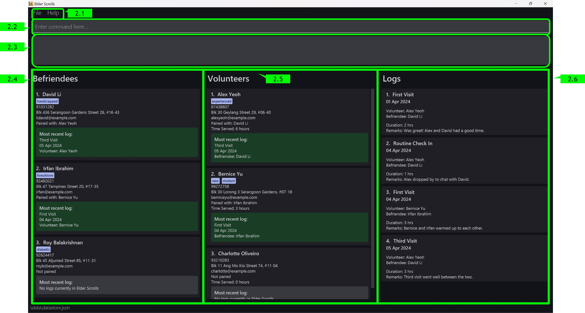
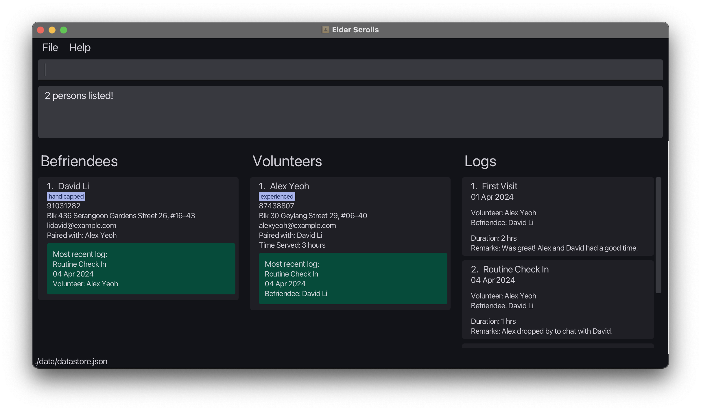
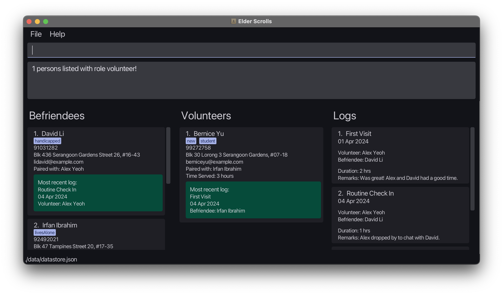

## **Introduction - What is Elder Scrolls?**

**Elder Scrolls** is a ___Volunteer Management System (VMS)___ designed to streamline the coordination of volunteers and befriendees, with a particular focus on elderly befriending programs. Elder Scrolls combines the _speed of CLI interaction_ with the benefits of a _Graphical User Interface (GUI)_. Whether you prefer the agility of typing or the convenience of visual interaction, Elder Scrolls ensures that your volunteer management tasks are completed swiftly and seamlessly.

**Our target audience** primarily consists of _volunteer managers_ responsible for organizing and overseeing activities related to _elderly befriending initiatives_. However, with its customizable features and flexible architecture, Elder Scrolls can be extended to cater to various types of volunteer management programs with minor adjustments. Whether you're managing volunteers for elderly care, community outreach, or other social services, Elder Scrolls offers a comprehensive solution to simplify and enhance your volunteer management efforts.

**No more cumbersome bookkeeping**: manage volunteers and befriendees seamlessly in one intuitive platform. Say goodbye to endless spreadsheets – Elder Scrolls centralizes tasks, making them faster and more effective. Developed for efficiency by our team, ___Elder Scrolls lets you focus on what matters most – making a difference in the lives of others___.

## **About this User Guide**

Welcome to the user guide for Elder Scrolls! Whether you're new or experienced, this guide has everything you need to make the most of Elder Scrolls:

* [Quick Start](#1-quick-start): Get started with Elder Scrolls quickly and easily.
* [User Interface](#2-user-interface): Understand the intuitively simple layout of Elder Scrolls.
* [Features](#3-features): Explore all the functionalities of Elder Scrolls.
* [Command Summary](#8-command-summary): Find all the essential commands at a glance.
* [FAQs](#6-faq-frequently-asked-questions): Get answers to common questions about Elder Scrolls.

Let's dive in and maximize your Elder Scrolls experience!

--------------------------------------------------------------------------------------------------------------------

## **Table of Contents**

* Table of Contents
{:toc}

--------------------------------------------------------------------------------------------------------------------

## **Setting Up**

Before getting started with Elder Scrolls, let's ensure everything is set up for Elder Scrolls to run correctly:

1. Ensure you have `Java 11` installed on your computer. This is crucial for Elder Scrolls to function properly.
    * If you're unsure whether Java 11 is installed, follow this short [guide](https://www.baeldung.com/java-check-is-installed) to check.
    * Install Java 11 (if needed): If Java 11 is not installed, follow the provided installation instructions [here](https://docs.oracle.com/en/java/javase/11/install/overview-jdk-installation.html#GUID-8677A77F-231A-40F7-98B9-1FD0B48C346A). If you're using a Mac computer with Apple Silicon, you can download Java 11 from [here](https://www.azul.com/downloads/?version=java-11-lts&os=macos&architecture=arm-64-bit&package=jdk-fx#zulu) instead.
2. Next, download our latest `elderscrolls.jar` release [here](https://github.com/AY2324S2-CS2103T-T09-3/tp/releases).
3. Next, copy the downloaded `elderscrolls.jar` to the desired home folder for Elder Scrolls. Elder Scrolls will store all application files and data in this folder, so it is best to create an empty folder for this purpose.

--------------------------------------------------------------------------------------------------------------------

 
 

## **1. Quick Start**

Once you've completed the setup, you're ready to launch Elder Scrolls! Follow these steps to get started:

1. Launch Elder Scrolls: Open a command terminal, `cd` into the folder you put the jar file in, and use the `java -jar elderscrolls.jar` command to run the application. 

A GUI similar to the below should appear in a few seconds. If this is your first time launching Elder Scrolls, the application should contain some sample data to get you started!

  
  

After this, you're all set to begin using Elder Scrolls! Let's make managing volunteers and befriendees a breeze.

Here are some commands to get you started:

   * `find David`: Finds all contacts with names containing `David`.

   * `list` : Lists all befriendee and volunteer contacts.

   * `add n/John Doe p/98765432 e/johnd@example.com a/John street, block 123, #01-01 r/volunteer` : Adds a volunteer named `John Doe` to the Elder Scrolls.

   * `delete 4 r/volunteer ` : Deletes the 4th contact shown in the current list.

   * `clear` : Deletes all contacts.

   * `exit` : Exits the app.

   * Refer to the [Features](#3-features) below for details of each command.

Great! Now that you're familiar with the fundamental commands and have successfully launched Elder Scrolls, let's delve deeper into its intricacies and explore its advanced functionalities.

--------------------------------------------------------------------------------------------------------------------

## **2. User Interface**

  

  <text><u> Image: User interface Layout Breakdown of Elder Scrolls </u></text>

### 2.1 Toolbar

The toolbar at the top provides functionality for accessing help and exiting Elder Scrolls. The application window contains the following buttons:
* `File`: Hovering over opens a dropdown menu, click on Exit to close the application!
* `Help`: Hovering over open a dropdown menu, whereby clicking on Help F1 opens a help pop-up!

### 2.2 Command Input Box

The command input box at the top of the application window is where you can type commands to interact with Elder Scrolls. Press `Enter` to execute the command.

### 2.3 Command Output Box

The command output box displays the results of the commands you have executed. It also displays error messages when an invalid command is entered. Paying close attention to the feedback provided here helps enhance your experience with Elder Scrolls!

### 2.4 Befriendee List Panel

This section displays all your registered befriendees, and you may filter the display using our supported find commands. The list is updated in real-time as you execute commands.

### 2.5 Volunteer List Panel

Similar to the Befriendee List Panel, this section displays all your registered volunteers. The volunteer list cards also support an added aggregate statistic `Time Served`, that helps you better track volunteer hours!

### 2.6 Log List Panel

Your Log List Panel displays all logs associated with your befriendees and volunteers.

--------------------------------------------------------------------------------------------------------------------

 
 

## **3. Features**

**:information_source: Notes about the command format:** 

* Words in `UPPER_CASE` are placeholders to represent parameters that should be supplied by the user. 
  e.g. in `add n/NAME`, `NAME` is a parameter which can be used as `add n/John Doe`.

* Items in square brackets are optional. 
  e.g `n/NAME [t/TAG]` can be used as `n/John Doe t/friend` or as `n/John Doe`.

* Items with `…`​ after them can be used multiple times including zero times. 
  e.g. `[t/TAG]…​` can be used as ` ` (i.e. 0 times), `t/friend`, `t/friend t/family` etc.

* Parameters can be in any order. 
  e.g. if the command specifies `n/NAME p/PHONE_NUMBER`, `p/PHONE_NUMBER n/NAME` is also acceptable.

* Extraneous parameters for commands that do not take in parameters (such as `help`, `list`, `exit` and `clear`) will be ignored. 
  e.g. if the command specifies `help 123`, it will be interpreted as `help`.

* If you are using a PDF version of this document, be careful when copying and pasting commands that span multiple lines as space characters surrounding line-breaks may be omitted when copied over to the application.

 
 

### **3.1 Volunteer / Befriendee Management**

#### 3.1.1 Adding a Volunteer or Befriendee: `add`

Adds a volunteer / Befriendee to the address book.

Format: `add n/NAME r/ROLE p/PHONE_NUMBER e/EMAIL a/ADDRESS [t/TAG]…​`
Where `ROLE` must be either `volunteer` or `befriendee` to add a volunteer or befriendee respectively.

:bulb: **Tip:**
A person can have any number of tags (including 0)

Examples:
* `add n/John Doe r/volunteer p/98765432 e/johnd@example.com a/John street, block 123, #01-01`
* `add n/Betsy Crowe r/befriendee t/friend e/betsycrowe@example.com a/Newgate Prison p/1234567 t/criminal t/homicide`

#### 3.1.2 Editing a person : `edit`

Edits an existing person in Elder Scrolls.

Format: `edit INDEX r/ROLE [n/NAME] [p/PHONE] [e/EMAIL] [a/ADDRESS] [t/TAG]…​`

* Edits the person at the specified `INDEX`. The index refers to the index number shown in the displayed person list. The index **must be a positive integer** 1, 2, 3, …​
* At least one of the optional fields must be provided.
* Existing values will be updated to the input values.
* When editing tags, the existing tags of the person will be removed i.e adding of tags is not cumulative.
* You can remove all the person’s tags by typing `t/` without
    specifying any tags after it.

Examples:
*  `edit 1 r/volunteer p/91234567 e/johndoe@example.com` Edits the phone number and email address of the 1st person to be `91234567` and `johndoe@example.com` respectively.
*  `edit 2 r/befriendee n/Betsy Crower t/` Edits the name of the 2nd person to be `Betsy Crower` and clears all existing tags.

[//]: # (Page Break:)

 
 

#### 3.1.3 Pairing a befriendee and volunteer : `pair`

Pairs an existing befriendee and volunteer in Elder Scrolls.

Format: `pair BEFRIENDEE_INDEX VOLUNTEER_INDEX`

* The index refers to the index number shown in the displayed person list.
* The Person at `BEFRIENDEE_INDEX` must be a volunteer and the Person at `VOLUNTEER_INDEX` must be a befriendee.
* Both Persons must not be paired, or must be unpaired before pairing again.

Examples:
*  `pair 1 2` Pairs the befriendee at Index 1 of the befriendee list and the volunteer at Index 2 of the volunteer list.
*  `pair 3 3` Pairs the befriendee at Index 3 of the befriendee list and the volunteer at Index 3 of the volunteer list.

#### 3.1.4 Unpairing a befriendee and volunteer : `unpair`

Pairs an existing befriendee and volunteer in Elder Scrolls.

Format: `unpair BEFRIENDEE_INDEX VOLUNTEER_INDEX`

* The index refers to the index number shown in the displayed person list.
* The Person at `BEFRIENDEE_INDEX` must be a volunteer and the Person at `VOLUNTEER_INDEX` must be a befriendee.
* The befriendee and volunteer must be paired with each other before they can be unpaired.

Examples:
*  `unpair 1 2` Unpairs the befriendee at Index 1 of the befriendee list and the volunteer at Index 2 of the volunteer list.
*  `unpair 3 3` Unpairs the befriendee at Index 3 of the befriendee list and the volunteer at Index 3 of the volunteer list.

#### 3.1.5 Listing all persons : `list`

Shows a list of all persons in Elder Scrolls.

Format: `list`

* Persons are listed in the order they were added.
* The list command is commonly used with the `find` command to reset the view after a search.

#### 3.1.6 Locating persons: `find`

Find persons through a variety of filters.

Format: `find [FILTERS]`
Alternative format: `search [FILTERS]`

**At least 1** filter must be provided. 
The following filters are supported:

* By name: `NAME`
* By pairing status: `--paired` or `--unpaired`
* By tag: `t/TAG`
* By role: `r/ROLE`

##### By name: `NAME`

In its most basic form, the command requires a single _case-insensitive_ `NAME` filter, which will filter both lists for all persons whose **names** contain the given `NAME`. Only full words will be matched.

Example: `find david` (finds all persons with `David`, `david`, etc. in their names, but will not find `Davidson` or `Davidsonson`)

`NAME` is also the **only** filter which can be provided multiple times. Providing multiple `NAME` filters will return all persons whose names contain any of the given `NAME`s.

Example: `find David Yeoh` (finds all persons with `David` _or_ `Yeoh` in their names, like `David Li`, `Alex Yeoh`, and even `Yeoh David`)

##### By pairing status: `--paired` or `--unpaired`

If the `--paired` or `--unpaired` filter is provided, the search will be limited to either paired or non-paired persons.

Examples: 
* `find --unpaired` (finds all unpaired persons)
* `find --paired David` (finds all paired persons with `David` in their names)

##### By tag: `t/TAG`

If the _case-sensitive_ `t/TAG` filter is provided, the search will be limited to persons with the specified tag(s).

Example: `find t/friend` (finds all persons who have the tag `friend`)

##### By role: `r/ROLE`

The `r/ROLE` filter is provided, the search will be limited to the specified list. The other list remains unaffected.
Only two versions of this filter are allowed: `r/volunteer` and `r/befriendee`.

:bulb: **Disclaimer:**
The `r/ROLE` filter can only be applied together with another filter. It cannot be used on its own.

Example: `find r/volunteer David` (finds all volunteers with `David` in their names, the befriendee list remains unfiltered)

##### Combining filters

* Different types of filters can be combined to narrow down the search results further.
* When multiple filters are provided, each filter should be separated by a space. 
* The order in which filters are provided does not matter.

Examples:
* `find alex david`
  
* `find r/volunteer t/student --paired Bernice` (finds all paired volunteers with the tag `student` and name containing `Bernice`)
  

:bulb: **Tip:**
Use the `list` command to reset your view after using the `find` command.

[//]: # (Page Break:)

 
 

#### 3.1.7 Deleting a person : `delete`, `del`, `remove`, `rm`

Deletes the specified person from the address book. Deleted person must not be paired with any other person. Additionally, deletion is not allowed if there exists associated logs to the person. A paired person must be unpaired, with all associated logs deleted before the person may be removed from Elder Scrolls, to ensure consistency of data. 

Format: `delete INDEX r/ROLE`

* Deletes the person at the specified `INDEX`.
* The index refers to the index number shown in the displayed person list.
* The index **must be a positive integer** 1, 2, 3, …​

Examples:
* `list` followed by `delete 2 r/volunteer` Deletes the 2nd volunteer in the address book.
* `find Betsy` followed by `del 1 r/befriendee` Deletes the 1st befriendee in the results of the `find` command.

--------------------------------------------------------------------------------------------------------------------
[//]: # (Page Break:)

 
 

### **3.2 Log Management**

#### 3.2.1 Adding a log : `logadd`

Adds a log between a pair of befriendee and volunteer. If it is the most recent log for a befriendee or volunteer, their `latest log` card details updates accordingly.

Format: `logadd BEFRIENDEE_INDEX VOLUNTEER_INDEX t/TITLE s/START_DATE d/DURATION r/REMARKS`

* The index refers to the respective index number shown in the befriendee and volunteer lists.
* The two Persons must be paired before a log can be added.
* The index **must be a positive integer** 1, 2, 3, …​
* The `START_DATE` must be in the format `YYYY-MM-DD`.
* The `DURATION` **must be a positive integer** 1, 2, 3, …​

Examples:
* `logadd 1 1 t/Movies s/2020-01-09 d/3 r/had popcorn` Adds a log between the befriendee at Index 1 and the volunteer at Index 1 with the title `Movies`, start date `2020-01-09`, duration `3` and remarks `had popcorn`.
* `logadd 2 3 t/Shopping s/2020-09-09 d/2 r/bought groceries` Adds a log between the befriendee at Index 2 and the volunteer at Index 3 with the title `Shopping`, start date `2020-09-09`, duration `2` and remarks `bought groceries`.

#### 3.2.2 Editing a log : `logedit`

Edits an existing log in Elder Scrolls.

Format: `logedit INDEX [t/TITLE] [s/START_DATE] [d/DURATION] [r/REMARKS]`

* Edits the log at the specified `INDEX`. The index refers to the index number shown in the displayed log list. The index **must be a positive integer** 1, 2, 3, …​
* At least one of the optional fields must be provided.
* Existing values will be updated to the input values.
* The `START_DATE` must be in the format `YYYY-MM-DD`.
* The `DURATION` **must be a positive integer** 1, 2, 3, …​

Examples:
* `logedit 1 t/Cinema Visit s/2020-01-10 d/3 r/had popcorn` Edits the title, start date, duration and remarks of the 1st log to be `Movies`, `2020-01-09`, `3` and `had popcorn` respectively.

#### 3.2.3 Deleting a log : `logdelete`, `logdel`, `logremove`, `logrm`

Deletes the specified log from the address book.

Format: `delete INDEX`

* Deletes the log at the specified `INDEX`.
* The index refers to the index number shown in the displayed log list.
* The index **must be a positive integer** 1, 2, 3, …​

Examples:
* `list` followed by `logdelete 1` deletes the 1st log in the address book.
* `logfind 1 r/befriendee` followed by `logdelete 1` deletes the 1st log in the results of the `logfind` command.

#### 3.2.4 Finding a log associated with a person: `logfind`

Find all logs associated with a person.

Format: `logfind INDEX r/ROLE`

* The index refers to the index number shown in either the befriendee or volunteer list.
* The index **must be a positive integer** 1, 2, 3, …​

Examples:
* `logfind 1 r/befriendee` returns all logs associated with the befriendee at Index 1.
* `logfind 2 r/volunteer` returns all logs associated with the volunteer at Index 2.

--------------------------------------------------------------------------------------------------------------------
[//]: # (Page Break:)

 
 

### **3.3 Undo and Redo Functionality**
#### 3.3.1 Undo the most recent command : `undo`

Undo the latest command that made a change to the data stored in Elder Scrolls.
This excludes commands like `list`,`find` and `logfind` which do not mutate the state of any data.

Format: `undo`

* The persons list and logs list will be refreshed to show all entries.
* There must have been a previous command executed that modified data in Elder Scrolls.
* At every launch of the application, there will be no commands to be undone.
* Undo history will be erased when you exit the application.

Example:
* If you mistakenly executed a `clear` command, clearing every entry in Elder Scrolls, fret not. Simply execute the command `undo` to revert the changes and all your entries in Elder Scrolls will be restored to their previous state, before the `clear` command was executed.
* If you've just performed multiple `delete` commands in sequence, and realised you've deleted the wrong entries. You can execute simultaneous `undo` commands to revert the changes made by the wrongful delete commands.

#### 3.3.2 Revert the most recent undo command : `redo`

Reverts data stored in Elder Scrolls back to its state before execution of latest undo command.

Format: `redo`

* The persons list and logs list will be refreshed to show all entries.
* When a command that modifies data in Elder Scrolls is executed after an undo command is executed, the redo command will no longer be available.
* There must have been a previous undo command executed in Elder Scrolls.
* Redo history will be erased when you exit the application.

Examples:
* After executing a successful `undo` command, if you were to call any command that modifies the data in Elder Scrolls, such as `delete`, the `redo` command will not longer be available.
* Let's say you've just executed a `add`, and mistakenly executed a `undo` command right after. You can then call `redo` to once again execute the `add` that was previously undone.

--------------------------------------------------------------------------------------------------------------------
[//]: # (Page Break:)

### **3.4 Other Commands: Help, Clear and Exiting**

#### 3.4.1 Viewing help : `help`

Shows a message explaning how to access the help page.  
Format: `help`

[//]: # (![help message]&#40;images/helpMessage.png&#41;)

  
  

#### 3.4.2 Clearing all entries : `clear`

Clears all entries from Elder Scrolls.  
Format: `clear`

#### 3.4.3 Exiting the program : `exit`

Exits the program.  
Format: `exit`

## **4. Saving the data**

Elder Scrolls data are saved in the hard disk automatically after any command that changes the data. There is no need to save manually!

## **5. Editing the data file**

All application data is saved automatically as a JSON file `[JAR file location]/data/datastore.json`. Advanced users are welcome to update data directly by editing that data file.

:exclamation: **Caution:**
If your changes to the data file makes its format invalid, Elder Scrolls will discard all data and start with an empty data file at the next run. Hence, it is recommended to take a backup of the file before editing it. 
Furthermore, certain edits can cause the Elder Scrolls to behave in unexpected ways (e.g., if a value entered is outside of the acceptable range). Therefore, edit the data file only if you are confident that you can update it correctly.

## **6. FAQ: Frequently Asked Questions**

**Q**: ___Can I track volunteer hours and activities with Elder Scrolls?___  
**A**: Absolutely! Elder Scrolls includes features for logging volunteer activities, such as pairing volunteers with befriendees, recording service hours, and adding remarks. This functionality makes it easy to track volunteer contributions and monitor engagement.

**Q**: ___Is Elder Scrolls suitable for managing large volunteer teams?___  
**A**: Elder Scrolls is designed to handle volunteer management tasks efficiently, whether you're managing a small team or a large group of volunteers. Its intuitive interface and robust features make it suitable for organizations of all sizes.

**Q**: ___Is Elder Scrolls suitable for non-profit organizations?___  
**A**: Absolutely! Elder Scrolls is ideal for non-profit organizations looking to streamline their volunteer management processes. Whether you're coordinating volunteers for community events, outreach programs, or support services, Elder Scrolls can help simplify your workflow and enhance organizational efficiency.

**Q**: ___Can I access Elder Scrolls from multiple devices?___  
**A**: Elder Scrolls is designed to be your trusty sidekick on one device at a time. So, while you can't have it on multiple gadgets simultaneously, it's always ready to lend a hand on your desktop or laptop whenever you need it.

**Q**: ___Is there a way to back up my data?___  
**A**: Absolutely! Your Elder Scrolls data is like a prized possession, and just like any treasure, it's wise to keep it safe. After every tweak or change you make, your data gets automatically saved to a JSON file on your hard disk. But for that extra peace of mind, making a backup copy is never a bad idea!

**Q**: ___How do I transfer my data to another computer?___  
**A**: Moving to a new computer? No problem! Simply download Elder Scrolls on the new machine and swap the sample data file it creates with your precious data from the previous Elder Scrolls home folder. Your volunteers and befriendees are ready to join you on the next adventure!

**Q**:  ___What should I do if I encounter issues / want to suggest improvements for Elder Scrolls?___  
**A**: If you encounter any glitches, have questions or have suggestions, our team is here to assist you. Simply reach out to us, and we'll provide the necessary assistance to address your concerns. Alternatively, file an issue [here](https://github.com/AY2324S2-CS2103T-T09-3/tp/issues) on our GitHub repository, and we'll get back to you as soon as possible.

**Q**: ___Is Elder Scrolls open source?___  
**A**: Yes, it is! Elder Scrolls is an open-source project, which means its source code is freely available for anyone to view, modify, and distribute. This open nature fosters collaboration and innovation within the community, allowing users to contribute to its development and customize it to suit their needs.

**Q**: ___Is Elder Scrolls free to use?___  
**A**: Absolutely! Elder Scrolls is available free of charge, making it accessible to organizations and individuals of all sizes. Whether you're a non-profit organization, a community group, or an individual volunteer manager, you can download and use Elder Scrolls without any cost involved. Plus, being open source means you can also contribute to its ongoing development if you wish.

**Q**: ___Where can I find more resources on Volunteer Management Systems?___  
**A**: If you're looking for more information on Volunteer Management Systems, you're in the right place! Our team has meticulously designed Elder Scrolls with existing VMS guidelines in mind, ensuring it aligns seamlessly with industry standards.  

For additional resources, you can explore online forums, community groups, and volunteer management guides to learn more about best practices and strategies for effective volunteer coordination. Here are some resources we found useful:
* [NCSS SG: Roadmap for Selection & Implementation of Volunteer Management System, A Guide for Social Service Agencies, Singapore](https://www.ncss.gov.sg/docs/default-source/ncss-press-release-doc/volunteer-management-system-selection-and-implementation-roadmap-pdf.pdf)
* [NCVO UK: Choosing and implementing a volunteer management system](https://www.ncvo.org.uk/help-and-guidance/involving-volunteers/planning-for-volunteers/choosing-and-implementing-a-volunteer-management-system-1/)

--------------------------------------------------------------------------------------------------------------------
[//]: # (Page Break:)

 
 

## **7. Known issues**

1. **When using multiple screens**, if you move the application to a secondary screen, and later switch to using only the primary screen, the GUI will open off-screen. The remedy is to delete the `preferences.json` file created by the application before running the application again.

--------------------------------------------------------------------------------------------------------------------

## **8. Command summary**

Action | Format, Examples
--------|------------------
**Add** | `add n/NAME r/ROLE p/PHONE_NUMBER e/EMAIL a/ADDRESS [t/TAG]…​`   e.g., `add n/James Ho r/volunteer p/88889999 e/jamesho@example.com a/123, Clementi Rd, 1234665 t/friend t/colleague`
**Edit** | `edit INDEX r/ROLE [n/NAME] [p/PHONE_NUMBER] [e/EMAIL] [a/ADDRESS] [t/TAG]…​`  e.g.,`edit 2 n/James Lee e/jameslee@example.com`
**Pair** | `pair BEFRIENDEE_INDEX VOLUNTEER_INDEX`  e.g., `pair 1 2`
**Unpair** | `unpair BEFRIENDEE_INDEX VOLUNTEER_INDEX`  e.g., `unpair 1 2`
**List** | `list`
**Find** | `find [r/ROLE] [t/TAG] [--paired]/[--unpaired] KEYWORD [MORE_KEYWORDS]...`   e.g., `find r/volunteer --paired James`
**Delete** | `delete INDEX r/ROLE`  `del INDEX r/ROLE`  `remove INDEX r/ROLE`  `rm INDEX r/ROLE`  e.g., `delete 3 r/befriendee`
**LogAdd** | `logadd BEFRIENDEE_INDEX VOLUNTEER_INDEX t/TITLE s/START_DATE d/DURATION r/REMARKS`  e.g., `logadd 1 2 t/Movies s/2020-01-09 d/3 r/had popcorn`
**LogEdit** | `logedit INDEX [t/TITLE] [s/START_DATE] [d/DURATION] [r/REMARKS]`  e.g., `logedit 1 t/Movies s/2020-01-09 d/3 r/had popcorn`
**LogDelete** | `logdelete INDEX`  `logdel INDEX`  `logremove INDEX`  `logrm INDEX`  e.g., `logdelete 1`
**LogFind** | `logfind INDEX r/ROLE`  e.g., `logfind 1 r/befriendee`
**Undo** | `undo`
**Redo** | `redo`
**Help** | `help`
**Clear** | `clear`
**Exit** | `exit`

--------------------------------------------------------------------------------------------------------------------
[//]: # (Page Break:)

 
 

## **9. Glossary**

**Volunteer**: An individual who offers their time and services to social service agencies or causes without financial compensation, in this context they carry out befriending activities with the beneficiaries.

**Befriendee**: An individual who receives support, companionship, or assistance from volunteers, in this context they are the beneficiaries of the befriending activities.

**Befriending**: The act of providing companionship, support, or assistance to individuals in need, typically carried out by volunteers to enhance the well-being and quality of life of the befriendees. Examples include social visits, outings, and emotional support.

**Volunteer Management System (VMS)**: A digital volunteer management tool designed to aid an organisation in the management of volunteers to improve productivity and potentially enhance the volunteer experience.

**Elder Scrolls**: The Volunteer Management System (VMS) developed by our team for efficient management and bookkeeping of volunteers, befriendees, and their interactions.

**Command Line Interface (CLI)**: A text-based interface used for interacting with Elder Scrolls through commands typed into a terminal or command prompt.

**Graphical User Interface (GUI)**: A visual interface used for interacting with Elder Scrolls, providing intuitive controls and displays for managing volunteers, befriendees and logs.

**Java 11**: The minimum version of Java required for Elder Scrolls to function properly.

**Jar file**: A Java archive file containing all necessary components of Elder Scrolls for running the application.

**Index**: The position or number assigned to each item in a list, used for reference when performing actions such as editing or deleting entries in Elder Scrolls.

**Pairing**: The process of associating a volunteer with a befriendee in Elder Scrolls, allowing them to work together on activities or support services.

**Logs**: Records of interactions, activities, or events between volunteers and befriendees in Elder Scrolls, used for tracking service hours, progress, and communication.

**Backup**: A copy of Elder Scrolls data stored separately from the main application, used to safeguard against data loss or corruption.

**Open Source**: Software whose source code is freely available to the public, allowing users to view, modify, and distribute it according to open-source licenses.
