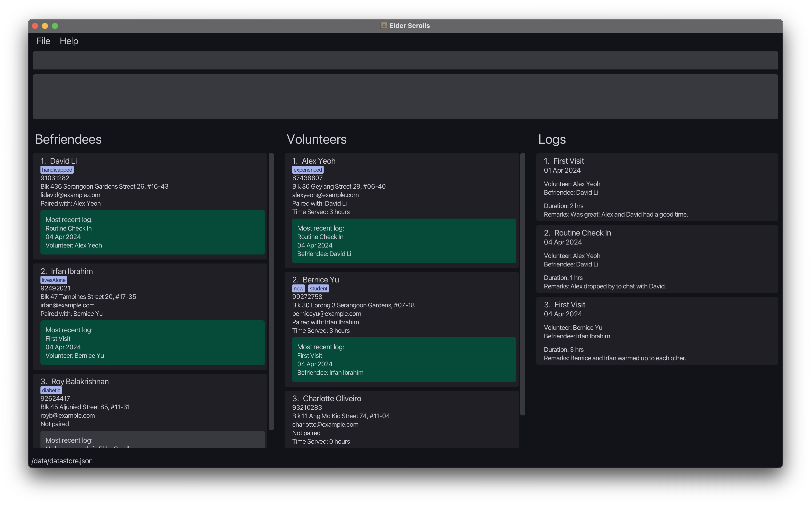

[//]: # (![Ui]&#40;images/Ui.png&#41;{: width="600"})

  

  <text> Elder Scrolls </text>
  

**Elder Scrolls** is a ___Volunteer Management System (VMS)___ designed to streamline the coordination of volunteers and befriendees, with a particular focus on elderly befriending programs. Elder Scrolls combines the _speed of CLI interaction_ with the benefits of a _Graphical User Interface (GUI)_. Whether you prefer the agility of typing or the convenience of visual interaction, Elder Scrolls ensures that your volunteer management tasks are completed swiftly and seamlessly.

**Our target audience** primarily consists of _volunteer managers_ responsible for organizing and overseeing activities related to _elderly befriending initiatives_. However, with its customizable features and flexible architecture, Elder Scrolls can be extended to cater to various types of volunteer management programs with minor adjustments. Whether you're managing volunteers for elderly care, community outreach, or other social services, Elder Scrolls offers a comprehensive solution to simplify and enhance your volunteer management efforts.

**No more cumbersome bookkeeping**: manage volunteers and befriendees seamlessly in one intuitive platform. Say goodbye to endless spreadsheets – Elder Scrolls centralizes tasks, making them faster and more effective. Developed for efficiency by our team, ___Elder Scrolls lets you focus on what matters most – making a difference in the lives of others___.

* If you are interested in using Elder Scrolls, head over to the [_Quick Start_ section of the **User Guide**](UserGuide.html#1-quick-start).
* If you are interested about developing Elder Scrolls, the [**Developer Guide**](DeveloperGuide.html) is a good place to start.

**Acknowledgements**

* Libraries used: [JavaFX](https://openjfx.io/), [Jackson](https://github.com/FasterXML/jackson), [JUnit5](https://github.com/junit-team/junit5)
* This project is based on the AddressBook-Level3 project created by the [SE-EDU initiative](https://se-education.org).
